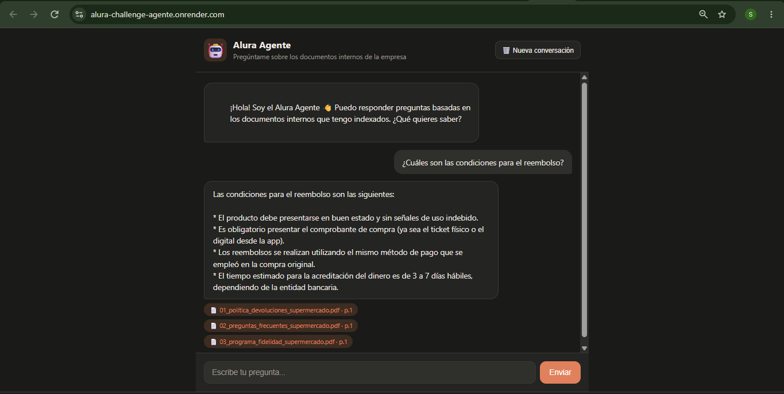

# Alura Agente - Supermercado La Espiga

Agente de inteligencia artificial corporativo que responde preguntas sobre los documentos internos de un supermercado ficticio, usando una arquitectura RAG (Retrieval-Augmented Generation).

Este proyecto lo desarrollé como entrega del desafío final Alura Agente, del programa Oracle Next Education (ONE).

---

## Descripción general

Soy la desarrolladora de este proyecto y lo construí pensando en un escenario real: una empresa (en este caso, un supermercado llamado "La Espiga") con documentos internos que sus colaboradoras y colaboradores consultan todo el tiempo, pero que les toma tiempo encontrar dentro de archivos PDF.

Este agente permite que cualquier persona escriba una pregunta en lenguaje natural y reciba una respuesta clara, basada únicamente en el contenido de los documentos indexados, junto con la fuente (nombre del archivo y número de página) de donde salió esa información. Si la pregunta no puede responderse con los documentos disponibles, el agente lo indica de forma explícita en vez de inventar una respuesta.

Para este proyecto elegí trabajar con 3 documentos PDF de una sola página cada uno, relacionados con la operación de un supermercado:

- **Política de Devoluciones y Reembolsos**: plazos de devolución según el tipo de producto, condiciones para el reembolso y productos que no admiten devolución.
- **Preguntas Frecuentes (FAQ)**: horarios de atención, funcionamiento del delivery, métodos de pago y políticas de cancelación.
- **Programa de Fidelidad "Cliente Espiga+"**: cómo se acumulan puntos, los niveles de membresía y cómo se canjean los beneficios.

El agente también mantiene memoria de la conversación: recuerda las preguntas y respuestas anteriores dentro de la misma sesión, para poder responder preguntas de seguimiento sin que el usuario tenga que repetir el contexto cada vez.

## Arquitectura de la solución

La aplicación es un monolito construido con FastAPI, que sirve tanto la interfaz web como la lógica del agente, todo desde un mismo servicio.

Cuando el servidor arranca, se leen los PDF de la carpeta `documents/`, se extrae su texto con `pypdf`, se divide en fragmentos más pequeños y cada fragmento se convierte en un vector numérico (embedding) usando el modelo de Gemini. Estos vectores se guardan en una base de datos vectorial en memoria (ChromaDB), junto con datos como el nombre del archivo y la página de origen. Decidí que este índice se reconstruya cada vez que el servidor arranca, en lugar de guardarlo en disco, porque Render (el proveedor de nube que uso) tiene almacenamiento efímero en su plan gratuito, y como solo trabajo con 3 documentos fijos, reconstruir el índice al iniciar es simple y confiable.

Cuando un usuario escribe una pregunta desde el navegador, esta llega al backend de FastAPI, que primero busca en ChromaDB los fragmentos de texto más relacionados con la pregunta por similitud semántica (y, si hay una conversación previa, también considera la última pregunta hecha para mejorar la búsqueda). Esos fragmentos se envían junto con la pregunta al modelo de chat de Gemini, con instrucciones claras de responder solo con base en ese contenido. La respuesta se transmite de vuelta al navegador en tiempo real, y al final se muestran las fuentes (archivo y página) usadas para construirla.

## Tecnologías y herramientas utilizadas

- **Backend:** FastAPI (Python)
- **Frontend:** HTML, CSS y JavaScript, con plantillas Jinja2
- **Framework de IA:** LangChain
- **Modelo de chat (LLM):** Gemini API, modelo `gemini-3.5-flash`
- **Modelo de embeddings:** Gemini API, modelo `models/gemini-embedding-001`
- **Lectura de PDF:** pypdf
- **Base de datos vectorial:** ChromaDB (en memoria)
- **Variables de entorno:** python-dotenv
- **Versión de Python:** 3.12.7
- **Despliegue:** Render (plan gratuito)


## Instrucciones para ejecutar el proyecto de forma local

1. Clonar el repositorio:


2. Crear un entorno virtual con Python 3.12 y activarlo:

   ```bash
   py -3.12 -m venv .venv
   .venv\Scripts\activate
   ```

3. Instalar las dependencias:

   ```bash
   pip install -r requirements.txt
   ```

4. Copiar el archivo `.env.example` como `.env` y colocar allí la clave de API de Gemini correspondiente (se obtiene de forma gratuita en Google AI Studio):

   ```
   GEMINI_API_KEY=tu_api_key_aqui
   ```

5. Verificar que los documentos PDF estén dentro de la carpeta `documents/` (en este repositorio ya vienen incluidos los 3 documentos del supermercado).

6. Ejecutar el servidor:

   ```bash
   uvicorn app.main:app --reload
   ```

7. Abrir `http://127.0.0.1:8000` en el navegador.

## Despliegue en la nube

La aplicación está desplegada en Render, usando el plan gratuito. El servicio se construye automáticamente a partir del repositorio de GitHub, instalando las dependencias con `pip install -r requirements.txt` y arrancando con `uvicorn app.main:app --host 0.0.0.0 --port $PORT`. La clave de API de Gemini se configura como variable de entorno directamente en el panel de Render, nunca se sube al repositorio.

### Evidencia del despliegue

- **Enlace de la aplicación en producción:** [https://alura-challenge-agente.onrender.com/](https://alura-challenge-agente.onrender.com/)
- **Captura de pantalla de la aplicación funcionando:**
  

## Ejemplos de preguntas y respuestas

A continuación algunos ejemplos reales de preguntas que el agente puede responder, basadas en los 3 documentos incluidos en este proyecto.

**Pregunta:** ¿Cuál es el plazo para devolver un producto no perecedero?

**Respuesta del agente:** Los productos no perecederos, como abarrotes, limpieza o bazar, pueden devolverse hasta 10 días corridos después de la compra, siempre que el empaque esté original y sin abrir, y se presente el comprobante de compra.
*Fuente: 01_politica_devoluciones_supermercado.pdf*
<br>
<br>

**Pregunta:** ¿Hasta qué hora atiende el supermercado los domingos?

**Respuesta del agente:** Las tiendas atienden todos los días, incluyendo domingos y feriados, de 7:00 a. m. a 10:00 p. m. El servicio de delivery está disponible de 8:00 a. m. a 9:00 p. m.
*Fuente: 02_preguntas_frecuentes_supermercado.pdf*
<br>
<br>

**Pregunta:** ¿Cuántos puntos se necesitan para llegar al nivel Espiga Premium?

**Respuesta del agente:** Para alcanzar el nivel Espiga Premium se necesitan 500 puntos o más acumulados durante el año, lo que da acceso a un 10% de descuento y envío gratis en los pedidos por delivery.
*Fuente: 03_programa_fidelidad_supermercado.pdf*
<br>
<br>

**Pregunta de seguimiento (usando la memoria de la conversación):**

**Pregunta 1:** ¿Cuántos puntos equivalen a un descuento?

**Pregunta 2:** ¿Y a cuánto dinero equivale eso?

**Respuesta del agente:** 100 puntos Espiga+ equivalen a S/ 5.00 de descuento sobre el total de la compra. Los puntos no pueden canjearse por dinero en efectivo.
*Fuente: 03_programa_fidelidad_supermercado.pdf*
<br>
<br>

**Pregunta fuera del alcance de los documentos:**

**Pregunta:** ¿Tienen sucursales en otros países?

**Respuesta del agente:** No encontré esta información en los documentos disponibles.

## Nota sobre el uso de planes gratuitos

Este proyecto fue construido usando únicamente herramientas y planes gratuitos: la API de Gemini (tanto para el modelo de chat como para el de embeddings) y el plan free de Render para el despliegue.

Por esta razón, es normal que:

- Las respuestas del agente tarden un poco más de lo esperado, sobre todo si el servicio en Render estuvo inactivo un rato y necesita "despertar".
- En momentos de mucho uso puede aparecer un error con código 429, que indica que se superó el límite de solicitudes gratuitas de la API de Gemini. En ese caso, la solución es simplemente esperar unos minutos y volver a intentar la pregunta.

## Notas y limitaciones

- El índice vectorial y el historial de conversación viven en memoria del proceso, por lo que se reinician si el servidor se reinicia o se redespliega.
- No se implementó un modelo de reranking adicional; la búsqueda de fragmentos se basa únicamente en similitud semántica vectorial.
- La memoria de conversación es por sesión y guarda únicamente los últimos intercambios, para no sobrecargar el contexto enviado al modelo.
